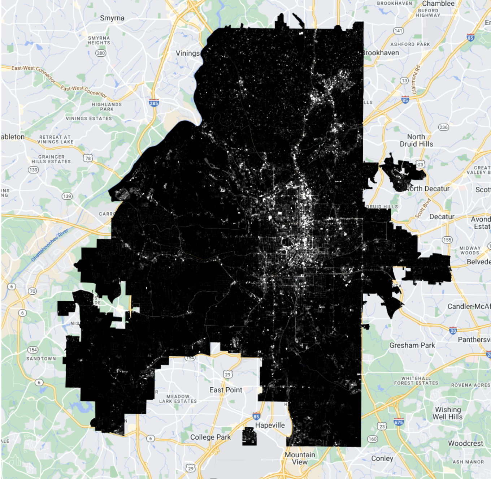
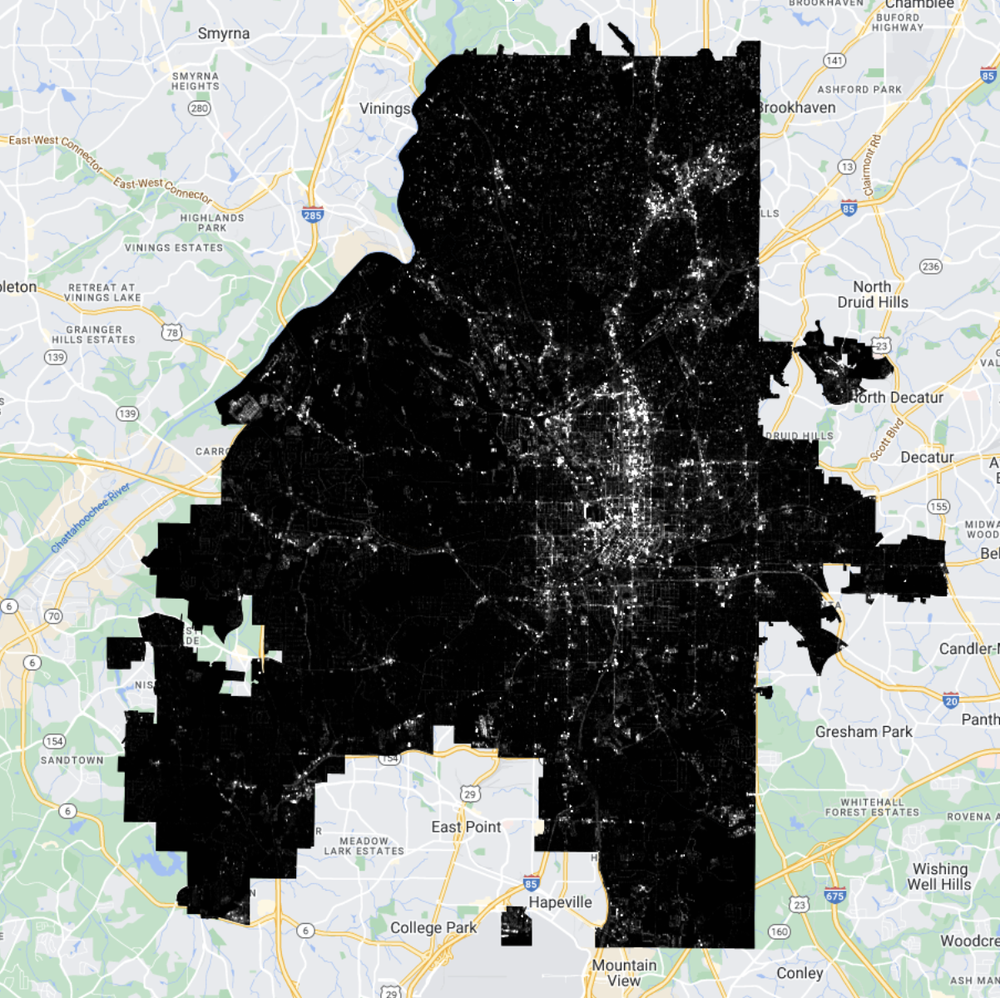
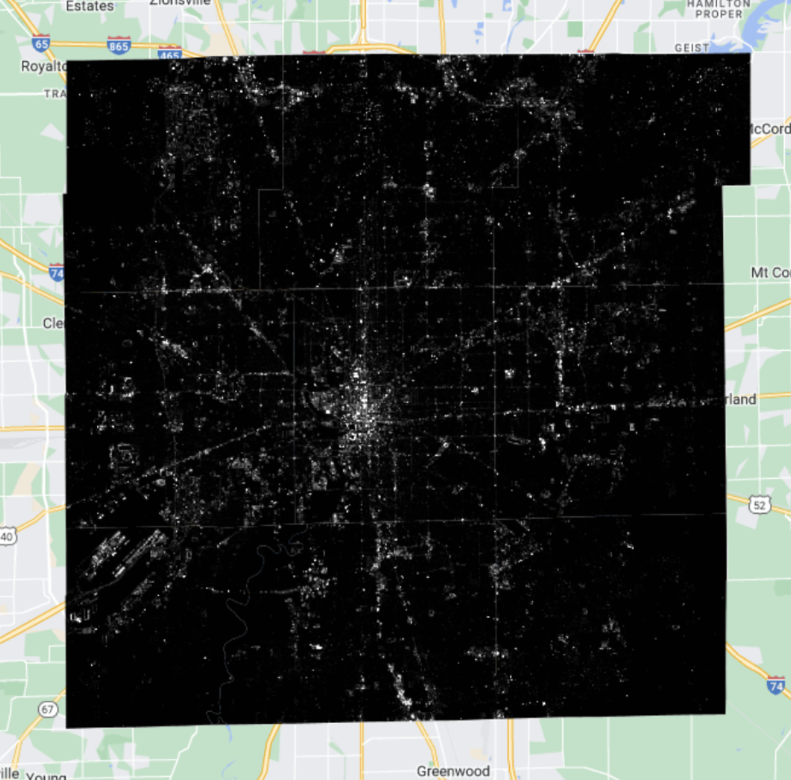
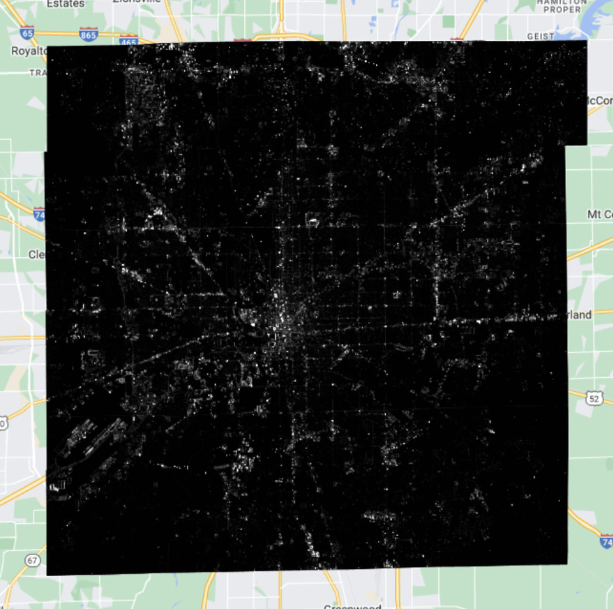
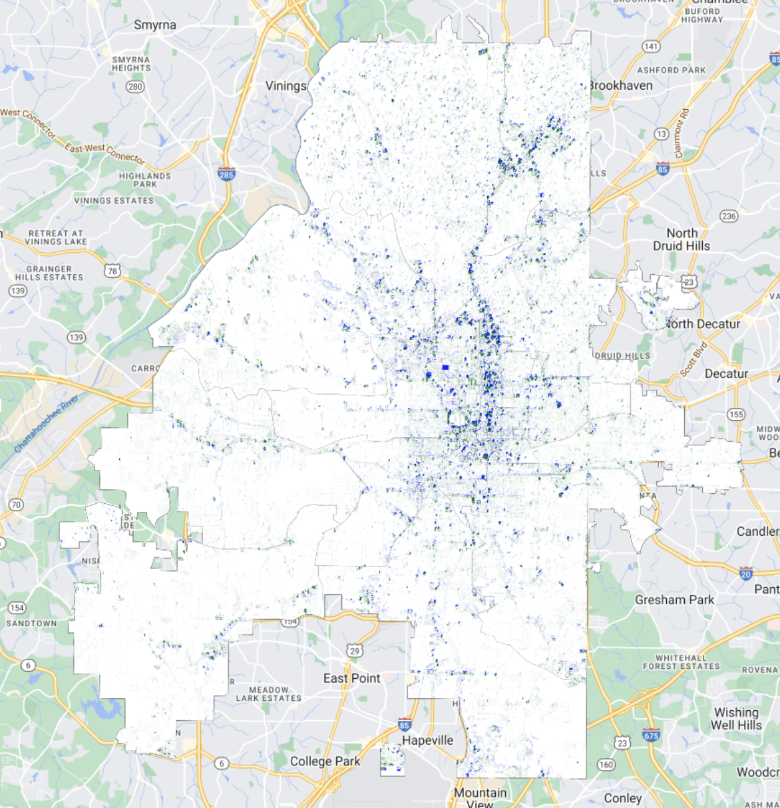
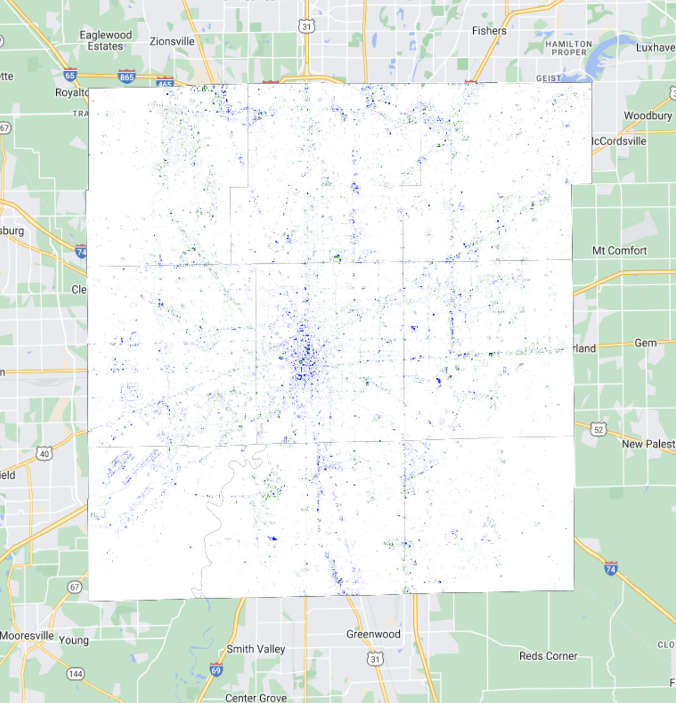

# Who Turned off the Lights: Analyzing Participation in the Earth Hour Campaign

### Team Member:
- Hyein Chae (Department of Built Environment)
- Yuying Xie (Department of Geography)

Organized by the World Wide Fund for Nature (WWF), [Earth Hour Campaign](https://www.earthhour.org/) encourages individuals, communities, and businesses worldwide to reduce energy use and raise awareness about climate change. Since its inception in Sydney in 2007, Earth Hour has grown into a global movement involving millions in over 190 countries.

Despite its popularity, the actual impact of Earth Hour on energy conservation and pro-environmental behavior remains unclear due to limited systematic evaluations (Kountouris, 2022; Olexsak & Meier, 2014). Previous research has primarily focused on social media engagement and electricity demand changes, yielding mixed results. For instance, Chan et al. (2020) found that Earth Hour effectively mobilized previously inactive individuals in Hong Kong, while Kountouris (2022) reported minimal long-term attitude shifts in Germany and the UK. Similarly, studies on electricity usage have shown varying outcomes, with some indicating significant reductions (Olexsak & Meier, 2014) and others suggesting limited energy savings (Solomon, 2008).

Critics like Chao (2020) argue that Earth Hour can impose Western environmental practices on diverse local contexts, highlighting the need for context-sensitive approaches. Olexsak and Meier (2014) stress the importance of systematic assessments to enhance the campaign's effectiveness and foster lasting environmental behaviors.

This mini study aims to evaluate the impact of Earth Hour 2024 by analyzing changes in nighttime lights using high-resolution satellite images. We will examine the spatial, socio-economic, and demographic patterns of participation to provide insights into Earth Hour’s effectiveness in promoting energy conservation across different communities.

## Method
We conduct two case studies to investigate participation in the Earth Hour event and the geographical and socio-economic characteristics of the participants. The first case study analyzes whether and how different land use types within Atlanta's neighborhoods are associated with significant changes in  NTL brightness under Earth Hour impact. The second case study examines the relationship between socio-economic and demographic factors and NTL brightness changes in Indianapolis, where we explore how variables such as income, education, and certain population correlate with participation in Earth Hour. We present satellite image analyzing here ([code](assets/Earth%20Engine%20Code)) for future study. 

## Data Sources
This project utilizes high-resolution nighttime light (NTL) from the [Sustainable Development Goals Science Satellite-1 (SDGSAT-1)](https://www.sdgsat.ac.cn/) Level 4 GIU (Glimmer Imager) dataset. SDGSAT-1 provides 10 m panchromatic and 40 m RGB bands, offering superior spatial resolution and higher temporal frequency compared to traditional NTL sources like DMSP and VIIRS. We use the panchromatic bands for their enhanced detail and sensitivity to brightness variations (Wang et al., 2024).

We analyzed NTL images from Atlanta, Georgia, and Indianapolis, Indiana, captured on Earth Hour 2024 (March 23) and a baseline date (April 13). Additionally, we incorporated geospatial data (land use and city boundaries) and socio-economic/demographic data from open data sources for Atlanta and US Census datasets for Indianapolis.

## Sample Pictures 

### Figure 1: Baseline and Event Day Images in Atlanta and Indianapolis

| Description                      | Image                                     |
|----------------------------------|-------------------------------------------|
| Baseline Image of Atlanta        |        |
| Event Day Image of Atlanta       |       |
| Baseline Image of Indianapolis    |  |
| Event Day Image of Indianapolis   | |

### Figure 2: NTL Brightness Change Index Mapping

| Description                      | Image                                     |
|----------------------------------|-------------------------------------------|
| Brightness Change Index _Atlanta |        |
| Brightness Change Index_Indianapolis    |  |

## Basic Findings
Using the panchromatic HDR band, we calculated the Brightness Change Index by comparing the brightness levels between the event and baseline dates. This index quantifies the reduction in lighting, attributed to participants turning off non-essential lights during Earth Hour.

- Atlanta:

Central and northern areas showed increased or stable brightness, likely due to higher commercial activity and dense residential zones. In contrast, southern and southwestern neighborhoods experienced notable brightness reductions, indicating higher participation in turning off lights.

- Indianapolis:

The central district exhibited brightness decreases, suggesting active participation. However, rural areas on the city’s periphery showed brightness increases, possibly due to ongoing activities or lower participation rates.
Overall Findings: Satellite image analysis revealed localized decreases in nighttime lighting during Earth Hour in both cities, demonstrating participation in the event. The varying patterns between Atlanta and Indianapolis suggest differences in urban density, land use, and community engagement levels affecting the campaign’s effectiveness.

## Disucssion for Future Study 
- The index we used to record the brightness change may be inappropriate to detect places where the lights turned off. The current brightness “difference” index can also have limitations such as including luminosity values during the event. Thus, despite the brightness decrease index (positive value of change index) seems to provide better results of correlation analysis with demographic factors, we need to develop a fine-tuned index to detect behaviors of turning-off lights. 
- We need to develop an index to detect places where the lights turned off rather than the brightness changes.
- It would be benificial to add an exclusion of non-built-up pixels for the brightness change from the neighborhood-level analysis. If a neighborhood has a large forest, it would bias the calculation of the mean value.
- The city boundary is different with the Census Tract boundary that could be find via oneline resouces. It makes city-focused studies more challenging for researchers compared to county-level analyses. Statistical models can be applied to mitigate data distortion in boundary areas.

## References:
Chan, H.-W., Pong, V., & Tam, K.-P. (2020). Explaining participation in Earth Hour: The identity perspective and the theory of planned behavior. Climatic Change, 158(3–4), 309–325. https://doi.org/10.1007/s10584-019-02554-y

Kountouris, Y. (2022). Awareness days and environmental attitudes: The case of the “Earth Hour.” Ecological Economics, 195, 107367. https://doi.org/10.1016/j.ecolecon.2022.107367

Olexsak, S. J., & Meier, A. (2014). The electricity impacts of Earth Hour: An international comparative analysis of energy-saving behavior. Energy Research & Social Science, 2, 159–182. https://doi.org/10.1016/j.erss.2014.04.014

Solomon, D. (2008). How Effective are Individual Lifestyle Changes in Reducing Electricity Consumption? - Measuring the Impact of Earth Hour. University of Chicago.

## Ongoing Reading List
Diamantopoulos, A., Schlegelmilch, B. B., Sinkovics, R. R., & Bohlen, G. M. (2003). Can socio-demographics still play a role in profiling green consumers? A review of the evidence and an empirical investigation. Journal of Business Research, 56(6), 465–480. https://doi.org/10.1016/S0148-2963(01)00241-7

Fernández, M., Burel, G., Alani, H., Piccolo, L. S. G., Meili, C., & Hess, R. (2015). Analysing engagement towards the 2014 Earth Hour Campaign in Twitter. EnviroInfo &ICT4S 2015: Building the Knowledge Base for Environmental Action and Sustainability, Copenhagen, Denmark (Forthcoming). http://enviroinfo2015.org/

Gifford, R., & Nilsson, A. (2014). Personal and social factors that influence pro-environmental concern and behaviour: A review: PERSONAL AND SOCIAL FACTORS THAT INFLUENCE PRO-ENVIRONMENTAL BEHAVIOUR. International Journal of Psychology, n/a. https://doi.org/10.1002/ijop.12034 

Guo, B., Hu, D., & Zheng, Q. (2023). Potentiality of SDGSAT-1 glimmer imagery to investigate the spatial variability in nighttime lights. International Journal of Applied Earth Observation and Geoinformation, 119, 103313. https://doi.org/10.1016/j.jag.2023.103313

Guo, H., Dou, C., Chen, H., Liu, J., Fu, B., Li, X., Zou, Z., & Liang, D. (2023). SDGSAT-1: The world’s first scientific satellite for sustainable development goals. Science Bulletin, 68(1), 34–38. https://doi.org/10.1016/j.scib.2022.12.014

Johnson, C. Y., Bowker, J. M., & Cordell, H. K. (2004). Ethnic Variation in Environmental Belief and Behavior: An Examination of the New Ecological Paradigm in a Social Psychological Context. Environment and Behavior, 36(2), 157–186. https://doi.org/10.1177/0013916503251478

Li, C., Chen, F., Wang, N., Yu, B., & Wang, L. (2023). SDGSAT-1 nighttime light data improve village-scale built-up delineation. Remote Sensing of Environment, 297, 113764. https://doi.org/10.1016/j.rse.2023.113764

Wang, N., Hu, Y., Li, X.-M., Lan, Y., Kang, C., Yan, L., Dou, C., & Miao, C. (2024). Enhancing SDGSAT-1 night light images using a panchromatic guidance denoising algorithm. International Journal of Applied Earth Observation and Geoinformation, 128, 103748. https://doi.org/10.1016/j.jag.2024.103748